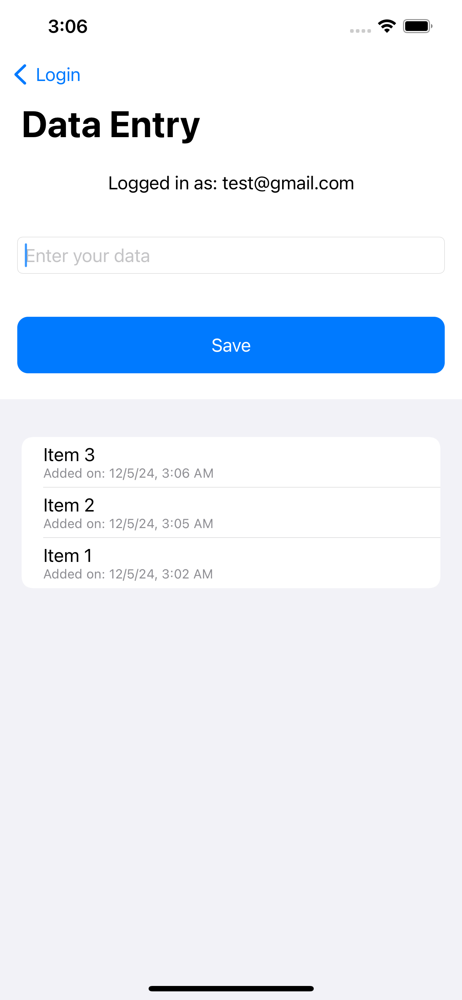

# Swift with Firebase

This project is a basic implementation of **Firebase** services with **Swift** in an iOS application. We connected Firebase to an Xcode project and explored two core functionalities:

1.  **Firebase Email/Password Authentication**
    -   Allowing users to register and log in securely.
2.  **Firestore Database**
    -   Storing and retrieving simple data from Firebase Firestore in real-time.

## Preview Table

| Picture 1   | Picture 2   | Picture 3   |
|-------------|-------------|-------------|
|  |  |  |

| Picture 4   |
|-------------|
|  |

| Picture 5   | Picture 6   
|-------------|-------------|
|  |  |

| Picture 7   |
|-------------|
|  |

----------

## Authors
- 2007068 (Faysal Mahmud)
- 2007074 (Mofazzal Hossen)
- 2007086 (Niloy Das)
